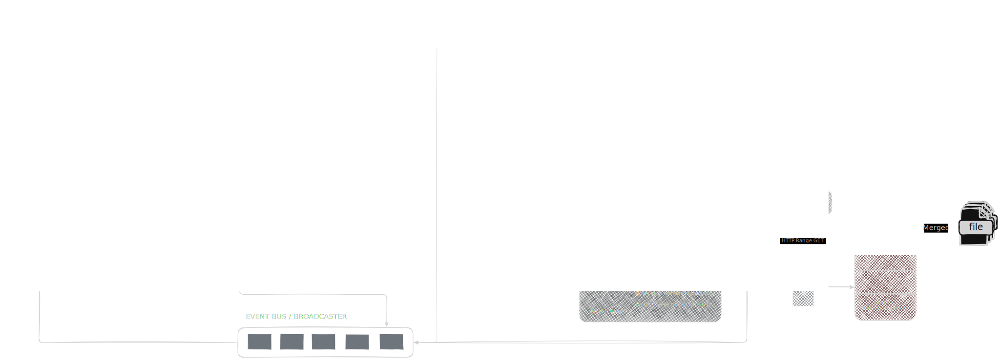

# GoFetch — Intelligent High-Performance Download Engine

<div align="center">


[![DeepWiki](https://img.shields.io/badge/DeepWiki-AppajiDheeraj%2FGoFetch-blue.svg?logo=data:image/png;base64,iVBORw0KGgoAAAANSUhEUgAAACwAAAAyCAYAAAAnWDnqAAAAAXNSR0IArs4c6QAAA05JREFUaEPtmUtyEzEQhtWTQyQLHNak2AB7ZnyXZMEjXMGeK/AIi+QuHrMnbChYY7MIh8g01fJoopFb0uhhEqqcbWTp06/uv1saEDv4O3n3dV60RfP947Mm9/SQc0ICFQgzfc4CYZoTPAswgSJCCUJUnAAoRHOAUOcATwbmVLWdGoH//PB8mnKqScAhsD0kYP3j/Yt5LPQe2KvcXmGvRHcDnpxfL2zOYJ1mFwrryWTz0advv1Ut4CJgf5uhDuDj5eUcAUoahrdY/56ebRWeraTjMt/00Sh3UDtjgHtQNHwcRGOC98BJEAEymycmYcWwOprTgcB6VZ5JK5TAJ+fXGLBm3FDAmn6oPPjR4rKCAoJCal2eAiQp2x0vxTPB3ALO2CRkwmDy5WohzBDwSEFKRwPbknEggCPB/imwrycgxX2NzoMCHhPkDwqYMr9tRcP5qNrMZHkVnOjRMWwLCcr8ohBVb1OMjxLwGCvjTikrsBOiA6fNyCrm8V1rP93iVPpwaE+gO0SsWmPiXB+jikdf6SizrT5qKasx5j8ABbHpFTx+vFXp9EnYQmLx02h1QTTrl6eDqxLnGjporxl3NL3agEvXdT0WmEost648sQOYAeJS9Q7bfUVoMGnjo4AZdUMQku50McDcMWcBPvr0SzbTAFDfvJqwLzgxwATnCgnp4wDl6Aa+Ax283gghmj+vj7feE2KBBRMW3FzOpLOADl0Isb5587h/U4gGvkt5v60Z1VLG8BhYjbzRwyQZemwAd6cCR5/XFWLYZRIMpX39AR0tjaGGiGzLVyhse5C9RKC6ai42ppWPKiBagOvaYk8lO7DajerabOZP46Lby5wKjw1HCRx7p9sVMOWGzb/vA1hwiWc6jm3MvQDTogQkiqIhJV0nBQBTU+3okKCFDy9WwferkHjtxib7t3xIUQtHxnIwtx4mpg26/HfwVNVDb4oI9RHmx5WGelRVlrtiw43zboCLaxv46AZeB3IlTkwouebTr1y2NjSpHz68WNFjHvupy3q8TFn3Hos2IAk4Ju5dCo8B3wP7VPr/FGaKiG+T+v+TQqIrOqMTL1VdWV1DdmcbO8KXBz6esmYWYKPwDL5b5FA1a0hwapHiom0r/cKaoqr+27/XcrS5UwSMbQAAAABJRU5ErkJggg==)](https://deepwiki.com/AppajiDheeraj/GoFetch)
<!-- DeepWiki badge generated by https://deepwiki.ryoppippi.com/ -->
[](https://golang.org/)
[](https://github.com/AppajiDheeraj/GoFetch/releases)
[](LICENSE)
[](https://github.com/AppajiDheeraj/GoFetch/actions)
[](https://goreportcard.com/report/github.com/AppajiDheeraj/GoFetch)

<h4>
  <a href="https://github.com/AppajiDheeraj/GoFetch/issues/new?template=bug_report.yml">Report Bug</a>
·    
  <a href="https://github.com/AppajiDheeraj/GoFetch/issues/new?template=feature_request.yml">Request Feature</a>
</h4>
</div>


## Overview

GoFetch is a high-performance concurrent file downloader written in Go that accelerates file transfers using adaptive parallelism, dynamic scheduling, and advanced network optimization techniques.

Unlike traditional downloaders that rely on fixed concurrency, GoFetch continuously monitors network conditions and automatically tunes worker concurrency, chunk sizes, and retry strategies using TCP-style congestion control principles. The system is designed as a production-grade download orchestration platform rather than a simple file downloader.

GoFetch provides a command-line interface, a server daemon for remote management, and a stable embeddable Go API for integration into other applications.

---

## Core Features

### Performance and Concurrency

* Adaptive worker scaling using Additive Increase Multiplicative Decrease (AIMD) control
* Concurrent chunk-based downloads using goroutines
* Dynamic chunk size optimization based on real-time network feedback
* Work stealing scheduler to eliminate idle workers and prevent slow connections from blocking progress
* Hedged requests to reduce tail latency
* HTTP Range request optimization for efficient partial content retrieval

### Intelligent Network Control

* Continuous monitoring of throughput, latency, and error signals
* Real-time worker rebalancing
* Adaptive retry and backoff strategies
* Network-aware scheduling and resource allocation

### Reliability and Robustness

* Resume support with persistent state storage
* Automatic failure recovery and retry handling
* Safe bounded writes and idempotent chunk processing
* Fault-tolerant download orchestration

### Observability and Event Streaming

* Real-time progress event streaming
* Publish-subscribe event system
* Structured progress and status updates
* Debug-level control loop logging

### Platform Capabilities

* Command-line interface for direct usage
* Server daemon mode for background operation
* Remote management via HTTP API
* Embeddable Go SDK
* Persistent download queue management

---

## Architecture

GoFetch follows a layered architecture with clear separation between user interfaces and the core download engine.

```
CLI / Server / API
        ↓
Core Download Service
        ↓
Download Manager
        ↓
Concurrent Engine / Single Engine
        ↓
Workers + Scheduler + Controller
```

### Architectural Principles

* Separation of concerns between interface and execution layers
* Pluggable download engines
* Centralized adaptive control loop
* Event-driven communication model
* Persistent state and recovery mechanisms
* Adaptive scheduling and resource management

</img>

---

## Adaptive Scaling Engine

GoFetch implements a self-learning control loop that continuously optimizes download performance.

### Metrics

* Throughput (bytes per second)
* Response latency and round-trip time approximations
* Retry and failure rates
* Chunk completion time
* Error signals

### Control Strategy

Additive increase is applied when network conditions are stable and throughput improves. Multiplicative decrease is applied when congestion or failures are detected. This approach enables fast convergence on optimal performance while maintaining system stability.

### Benefits

* Automatic optimization across different network conditions
* Stable behavior under high latency or packet loss
* Efficient resource utilization
* Improved throughput consistency

---

## Interface Model

### Command-Line Interface

The CLI provides direct interaction with the download engine.

```
gofetch add <url>
```

The CLI acts as a thin orchestration layer that invokes the same core service used by other interfaces.

### Public API (pkg/gofetch)

The public API allows GoFetch to be embedded into other Go applications.

```go
client, _ := gofetch.NewClient(&gofetch.ClientOptions{})
id, _ := client.Add(url, "./downloads", "", nil)
stream, cleanup, _ := client.StreamEvents(ctx)
```

Common use cases include automation tools, custom user interfaces, and distributed systems.

---

## Deployment Modes

| Mode         | Description            | Use Case                    |
| ------------ | ---------------------- | --------------------------- |
| CLI          | Direct execution       | Interactive downloads       |
| Server Mode  | Background daemon      | Persistent queue management |
| Embedded API | Go package integration | Application integration     |

### Server Mode

Server mode allows GoFetch to run as a background service and accept commands via HTTP, enabling persistent download queues and remote management.

```
gofetch server start
```

---

## Download Engine Strategy

During the probe phase, GoFetch determines server capabilities such as file size, metadata, and HTTP Range support. Based on these capabilities and configuration settings, the system selects either the concurrent download engine or a single-connection fallback.

---

## Event System

GoFetch uses an event-driven architecture for progress tracking and system observability. Events are published by download engines and consumed by the CLI, API clients, and server components.

Event types include:

* Download lifecycle events
* Chunk progress updates
* Completion notifications
* Error reporting
* Scheduler decisions

---

## State Persistence

The system persists download metadata to disk to enable:

* Resumption of interrupted downloads
* Crash recovery
* Progress tracking
* Continuity across restarts

---

## Concurrency Model

### Work Stealing

Idle workers dynamically acquire unfinished work from active workers to maintain high utilization.

### Hedged Requests

Slow tasks may be duplicated to race completion and reduce tail latency.

### Safety Guarantees

* Bounded byte ranges
* Idempotent writes
* Consistent state management

---

## Project Structure

```
GoFetch/
├── cmd/gofetch/          # CLI entry point
├── pkg/gofetch/          # Public API
├── internal/
│   ├── cli/              # CLI commands
│   ├── core/             # Service layer
│   ├── download/         # Download engines
│   │   ├── concurrent/
│   │   └── single/
│   ├── events/           # Event system
│   ├── state/            # Persistence
│   ├── config/           # Configuration
│   └── probe.go          # Server capability probing
└── docs/
```

---

## Installation

### From Source

```
git clone https://github.com/AppajiDheeraj/GoFetch.git
cd GoFetch
go build -o gofetch
./gofetch
```

### Using Go Install

```
go install github.com/AppajiDheeraj/GoFetch@latest
```

---


## Author

Appaji Dheeraj <br />
National Institute of Technology Karnataka, Surathkal
